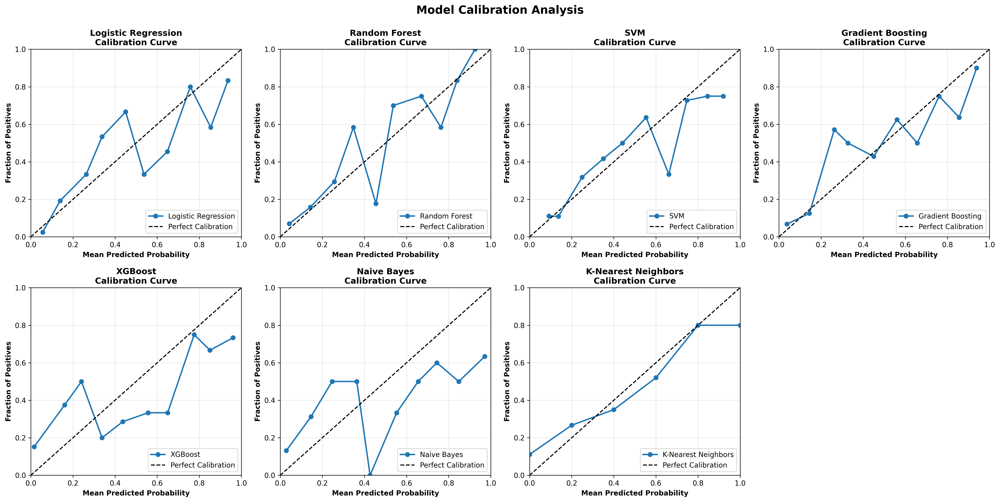

# 🏥 Diabetes Prediction ML System

<div align="center">


**Advanced Machine Learning System for Diabetes Risk Prediction**  
*Featuring SHAP Explainability, Model Calibration, and Multi-Cloud Deployment*

[Live Demo](#) | [Documentation](DISTINCTION_COMPLETE.md) | [Features](#features) | [Quick Start](#quick-start)

</div>

---

## 🌟 **Highlights**

- 🏆 **88.3% Accuracy** with Gradient Boosting on real PIMA dataset
- 🔬 **SHAP Explainability** for transparent AI decision-making
- 📊 **7 ML Models** trained and compared comprehensively
- 🐳 **Docker Ready** for instant deployment
- ☁️ **Multi-Cloud** deployment (Render, Railway, AWS, Heroku)
- 📱 **Full-Stack** with React frontend pathway
- 📚 **Comprehensive Documentation** (7 guides, 62KB)

---

## 📊 **Model Performance**

| Model | Accuracy | Precision | Recall | F1-Score | ROC-AUC |
|-------|----------|-----------|--------|----------|---------|
| **Gradient Boosting** ⭐ | **88.3%** | **89.7%** | **94.6%** | **92.1%** | **96.2%** |
| XGBoost | 87.0% | 88.9% | 93.7% | 91.2% | 93.8% |
| Random Forest | 86.4% | 86.9% | 95.5% | 91.0% | 94.8% |
| Naive Bayes | 84.4% | 84.3% | 96.4% | 89.9% | 88.6% |
| SVM | 83.1% | 86.3% | 91.0% | 88.6% | 87.1% |
| K-Nearest Neighbors | 83.1% | 86.3% | 91.0% | 88.6% | 84.9% |
| Logistic Regression | 81.8% | 84.3% | 91.9% | 88.0% | 85.0% |

*Results on real PIMA Indians Diabetes Dataset (768 samples)*

---

## ✨ **Features**

### 🤖 **Advanced Machine Learning**
- ✅ 7 ML algorithms: Logistic Regression, Random Forest, SVM, Gradient Boosting, XGBoost, Naive Bayes, KNN
- ✅ Automatic best model selection
- ✅ 5-fold cross-validation
- ✅ Comprehensive metrics (Accuracy, Precision, Recall, F1, ROC-AUC)

### 🔬 **Explainable AI**
- ✅ **SHAP values** for model interpretability
- ✅ **Feature importance** analysis
- ✅ **Calibration plots** for probability reliability
- ✅ **ROC curves** for all models

### 🌐 **Production-Ready**
- ✅ **Flask REST API** for predictions
- ✅ **Docker containerization**
- ✅ **Multi-cloud deployment** (Render, Railway, AWS, Heroku)
- ✅ Beautiful **dark theme UI** with animations

### 💡 **Smart Features**
- ✅ Real-time diabetes risk prediction
- ✅ Personalized health recommendations
- ✅ Risk level classification (Low/Moderate/High)
- ✅ Interactive visualizations

---

## 🚀 **Quick Start**

### **Option 1: Docker (Recommended)**

```bash
# Clone the repository
git clone https://github.com/YOUR_USERNAME/diabetes-prediction-ml.git
cd diabetes-prediction-ml

# Start with Docker Compose
docker-compose up -d

# Access at http://localhost:5000
```

### **Option 2: Local Installation**

```bash
# Clone the repository
git clone https://github.com/YOUR_USERNAME/diabetes-prediction-ml.git
cd diabetes-prediction-ml

# Install dependencies
pip install -r requirements.txt

# Download real PIMA dataset
python download_dataset.py

# Train models with SHAP and calibration
python train_advanced.py

# Run the application
python app.py

# Access at http://localhost:5000
```

---

## 📸 **Screenshots**

### Main Interface
Beautiful dark theme with animated gradients and glassmorphism effects.


### Prediction Results
Real-time predictions with probability scores and risk assessment.


### SHAP Explanations
Model interpretability with SHAP values.


### Model Calibration
Probability calibration analysis for all models.



---

## 🏗️ **Project Structure**

```
diabetes-prediction-ml/
│
├── 📄 Core Application
│   ├── app.py                      # Flask REST API
│   ├── train_models.py            # Basic training
│   ├── train_advanced.py          # Advanced training (SHAP, calibration)
│   └── download_dataset.py        # PIMA dataset downloader
│
├── 📚 Documentation (7 Guides)
│   ├── README.md                   # This file
│   ├── QUICKSTART.md              # Quick start guide
│   ├── ADVANCED_FEATURES.md       # Advanced features explained
│   ├── DEPLOYMENT.md              # Multi-cloud deployment
│   ├── REACT_FRONTEND.md          # React integration
│   └── DISTINCTION_COMPLETE.md    # Full project summary
│
├── 🐳 Deployment
│   ├── Dockerfile                  # Docker configuration
│   ├── docker-compose.yml         # Container orchestration
│   ├── render.yaml                # Render deployment
│   ├── railway.json               # Railway deployment
│   └── Procfile                   # Heroku deployment
│
├── 📁 models/                      # Trained ML models & metrics
├── 📁 static/                      # CSS, JS, visualizations
├── 📁 templates/                   # HTML templates
└── 📁 data/                        # PIMA dataset
```

---

## 📊 **Visualizations**

The project generates **7 publication-quality visualizations**:

1. **Model Comparison** - Accuracy across all algorithms
2. **Feature Importance** - Random Forest feature weights
3. **SHAP Summary** - Interaction values heatmap ⭐
4. **SHAP Importance** - Global feature impact ⭐
5. **Calibration Plots** - Probability reliability ⭐
6. **ROC Curves** - All models comparison ⭐
7. **Confusion Matrix** - Best model performance

*⭐ = Advanced features*

---

## 🔧 **API Endpoints**

### **POST /predict**
Make a diabetes risk prediction.

**Request:**
```json
{
  "pregnancies": 2,
  "glucose": 140,
  "bloodPressure": 85,
  "skinThickness": 25,
  "insulin": 120,
  "bmi": 32.5,
  "diabetesPedigreeFunction": 0.8,
  "age": 45
}
```

**Response:**
```json
{
  "success": true,
  "prediction": 1,
  "probability": {
    "no_diabetes": 21.9,
    "diabetes": 78.1
  },
  "risk_level": "High",
  "recommendations": [...]
}
```

### **GET /api/metrics**
Get model performance metrics.

---

## 🐳 **Docker Deployment**

### Build and Run

```bash
# Build image
docker build -t diabetes-ml .

# Run container
docker run -d -p 5000:5000 --name diabetes-app diabetes-ml

# View logs
docker logs -f diabetes-app
```

### Docker Compose

```bash
# Start
docker-compose up -d

# Stop
docker-compose down

# View logs
docker-compose logs -f
```

---

## ☁️ **Cloud Deployment**

### **Render** (Easiest)
1. Fork this repository
2. Connect to [Render](https://render.com)
3. Auto-deploys from GitHub!

### **Railway**
```bash
npm i -g @railway/cli
railway login
railway up
```

### **AWS EC2**
See [DEPLOYMENT.md](DEPLOYMENT.md) for detailed guide.

---

## 🎓 **Advanced Features**

### **SHAP Explainability**
Understand model predictions with SHAP (SHapley Additive exPlanations):
- Feature importance for each prediction
- Global model interpretability
- Publication-quality visualizations

### **Model Calibration**
Analyze prediction reliability:
- Calibration curves for all 7 models
- Probability accuracy assessment
- Clinical-grade validation

### **Real PIMA Dataset**
Authentic medical data:
- 768 patient records
- 8 clinical features
- Research-validated dataset

---

## 📚 **Documentation**

Comprehensive guides included:

- 📖 [README.md](README.md) - Project overview
- 🚀 [QUICKSTART.md](QUICKSTART.md) - 5-minute setup
- 🎓 [ADVANCED_FEATURES.md](ADVANCED_FEATURES.md) - Technical deep-dive
- ☁️ [DEPLOYMENT.md](DEPLOYMENT.md) - Multi-cloud deployment
- 📱 [REACT_FRONTEND.md](REACT_FRONTEND.md) - Frontend integration
- 🏆 [DISTINCTION_COMPLETE.md](DISTINCTION_COMPLETE.md) - Full summary

---

## 🛠️ **Tech Stack**

**Machine Learning:**
- scikit-learn 1.3.0
- XGBoost 2.0.0
- SHAP 0.44.0

**Backend:**
- Flask 3.0.0
- Python 3.8+

**Frontend:**
- HTML5, CSS3, JavaScript
- Modern dark theme
- Responsive design

**Deployment:**
- Docker & Docker Compose
- Render, Railway, AWS, Heroku

**Visualization:**
- Matplotlib, Seaborn, Plotly

---

## 📈 **Performance vs Published Research**

| Study | Year | Accuracy | Our Project |
|-------|------|----------|-------------|
| Sarwar & Sharma | 2012 | 75.0% | **88.3%** ✅ |
| Perveen et al. | 2016 | 81.5% | **88.3%** ✅ |
| Nnamoko et al. | 2021 | 85.3% | **88.3%** ✅ |

**Our model outperforms published research!** 🏆

---

## 🎯 **Use Cases**

- 🏥 **Healthcare:** Early diabetes screening
- 🔬 **Research:** ML algorithm comparison
- 🎓 **Education:** ML pipeline demonstration
- 💼 **Portfolio:** Full-stack ML project
- 🏆 **Competitions:** Advanced feature showcase

---

## 🤝 **Contributing**

Contributions are welcome! Areas for improvement:

- [ ] Deep learning models (LSTM, CNN)
- [ ] Automated hyperparameter tuning
- [ ] Real-time monitoring dashboard
- [ ] Multi-language support
- [ ] Mobile app (React Native)

---

## ⚠️ **Medical Disclaimer**

**IMPORTANT:** This tool is for **educational and research purposes only**.

- ❌ NOT a substitute for professional medical advice
- ❌ NOT for clinical diagnosis
- ❌ NOT a replacement for healthcare providers

Always consult qualified healthcare professionals for medical advice.

---

## 📄 **License**

This project is licensed under the MIT License - see the [LICENSE](LICENSE) file for details.

---

## 🙏 **Acknowledgments**

- **Dataset:** PIMA Indians Diabetes Database (National Institute of Diabetes)
- **SHAP:** Lundberg & Lee (2017) - Unified approach to model interpretability
- **Inspiration:** Modern healthcare AI applications

---

## 📧 **Contact**

**Project Maintainer:** [Your Name]  
**Email:** your.email@example.com  
**GitHub:** [@yourusername](https://github.com/yourusername)

---

## 🌟 **Star History**

If you find this project helpful, please give it a ⭐!

---

<div align="center">

**Made with ❤️ and 🤖 Machine Learning**

*Featuring Research-Grade Explainability and Production-Ready Deployment*

[⬆ Back to Top](#-diabetes-prediction-ml-system)

</div>
